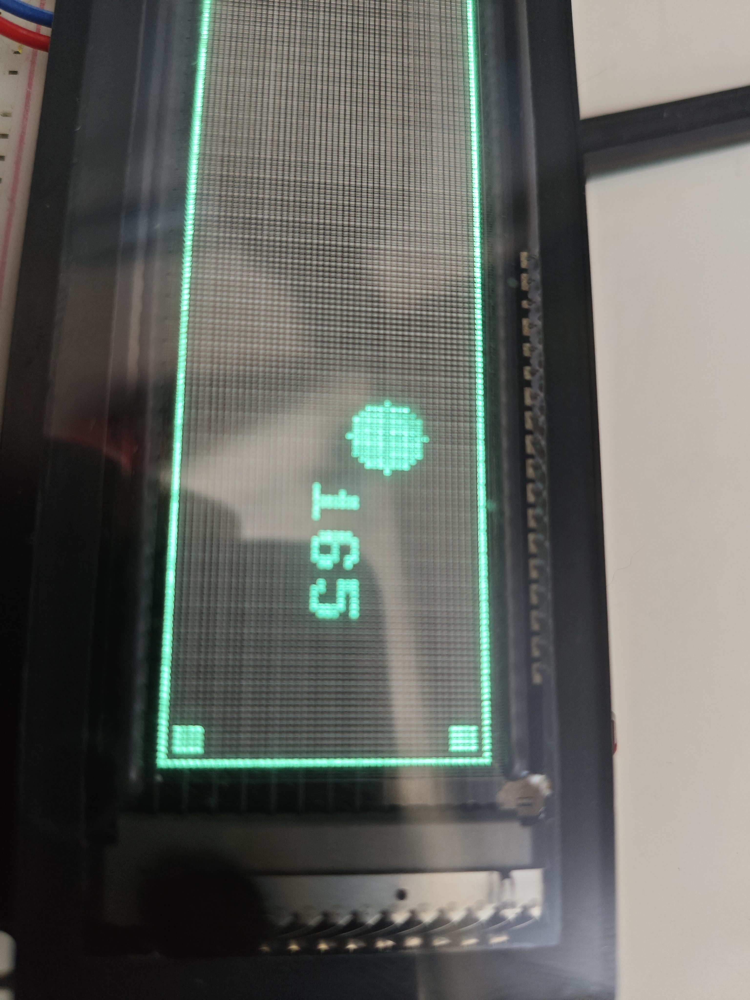
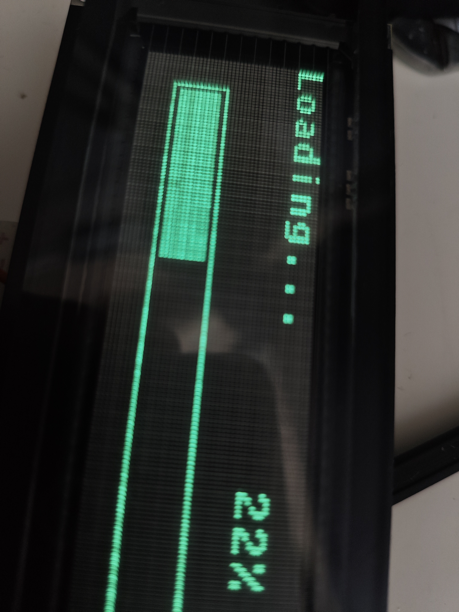
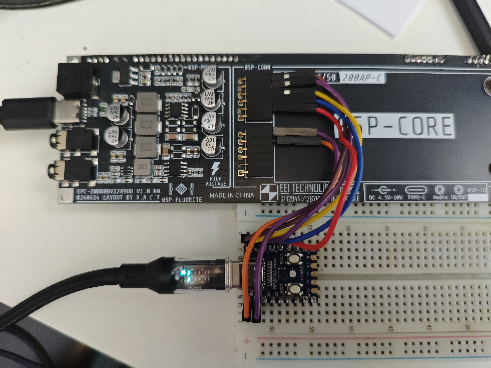

# GP1294AI VFD Display Driver for MicroPython

MicroPython driver for 256x48 pixel VFD modules using the GP1294AI controller, designed for RP2040.

[](https://youtu.be/iuFLHGyt5UY?si=IluFucB8iBytlPGr)

## Gallery

| Display Demo | Display Close-up | Wiring & PCB |
|:---:|:---:|:---:|
|  |  |  |

## Features

- Full 256x48 pixel resolution support
- Framebuffer-based drawing with MicroPython's `framebuf` module
- Graphics primitives: lines, rectangles, circles, text
- Brightness control (0-255)
- Simple API with `show()` to update display

## Quick Start

```python
from vfd_framebuffer import VFDFramebuffer

vfd = VFDFramebuffer()
vfd.init()

vfd.fill(0)
vfd.text("Hello VFD!", 10, 10, 1)
vfd.rect(0, 0, 256, 48, 1)
vfd.show()
```

## Hardware Wiring (RP2040 Zero)

| GPIO | Signal | Description |
|------|--------|-------------|
| GP0 | FIL_EN | Filament Enable |
| GP1 | CS# | Chip Select |
| GP2 | SCK | SPI Clock |
| GP3 | MOSI | SPI Data |
| GP4 | RST# | Reset |

Power: 5V (VBUS) and GND

## Display Specifications

| Parameter | Value |
|-----------|-------|
| Resolution | 256 x 48 pixels |
| GRAM | 512 x 64 (4096 bytes) |
| Mapping | 2 GRAM columns = 1 pixel |
| SPI Mode | Mode 3 (CPOL=1, CPHA=1) |

## Drawing Methods

From `framebuf.FrameBuffer`:
- `fill(c)`, `pixel(x, y, c)`
- `hline()`, `vline()`, `line()`
- `rect()`, `fill_rect()`
- `text(string, x, y, c)`

Additional methods:
- `show()` - Update display
- `draw_circle()`, `fill_circle()`
- `draw_progress_bar()`
- `center_text()`
- `set_brightness(0-255)`

## Files

| File | Description |
|------|-------------|
| `gp1294ai.py` | Low-level SPI driver |
| `vfd_framebuffer.py` | High-level framebuffer API |
| `main.py` | Demo application |

## License

MIT License
